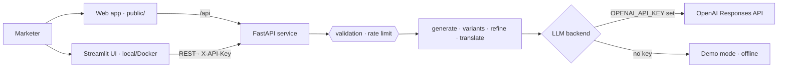

# Marketing Content Generator

[](https://github.com/MaHmOuDeB/MarketingWS/actions/workflows/ci.yml)

A generative-AI web service that drafts, refines and translates marketing copy for eight campaign
types: social posts, emails, PPC ads, blog introductions, re-engagement messages, seasonal
campaigns, product launches and crisis responses.

Built for my **Master's thesis in Data Science (2025)** and modernised in 2026: a FastAPI service
on OpenAI's current Responses API, a web app that deploys to Vercel, A/B variants, a behavioural
evaluation suite, an offline demo mode, tests and CI. See [CHANGELOG.md](CHANGELOG.md) for every change.

## What it does

- **Brief → first draft.** Pick a campaign type, platform, tone, audience and language; add your own
  instructions if needed.
- **Refine, don't regenerate.** Give feedback ("shorter, mention the free trial") and the model revises
  the *current* draft, keeping what works. A word-level diff shows exactly what changed.
- **Translate the draft** into German, French, Spanish, Italian, Portuguese or Dutch, keeping hashtags,
  emojis and placeholders intact.
- **Fits the channel.** Character limits per platform (X 280, LinkedIn 3,000, Google Ads 90 …): the
  model is asked to respect them, asked once more to shorten if needed, and only then trimmed at a word.
- **A/B variants.** Three versions of the same brief from different angles (benefit-led, question-led,
  proof-led), so a test compares approaches, not near-identical rewrites.
- **One-click refinements** ("Shorter", "More formal", "Stronger call to action", "No hashtags" …),
  a character meter against the platform limit, copy/download, light and dark themes, keyboard shortcuts.
- **Download** the final copy as text. Every version stays in the history.

## Thesis evaluation

The thesis version was evaluated with **9 professional marketers** over two rounds:

| Measure | Result |
|---|---|
| Usability (System Usability Scale) | **83 / 100** (above the commonly cited 80.3 threshold for an "A") |
| Relevance of the generated copy | **4.6 / 5** |
| Language quality (fluency) | **4.7 / 5** |
| Preferred it to writing manually | **7 of 9** participants |
| Time spent planning content | **50–70 % less**, as reported by participants |

The version that was evaluated is preserved under the tag
[`thesis-2025`](https://github.com/MaHmOuDeB/MarketingWS/tree/thesis-2025); sample outputs from the
evaluation are in [`examples/samples_thesis.csv`](examples/samples_thesis.csv).

## Architecture



- `backend/app/campaigns.py` — campaign briefs, platforms, output budgets, channel limits
- `backend/app/service.py` — the generate / variants / refine / translate workflow
- `backend/app/llm.py` — OpenAI backend (model set by `OPENAI_MODEL`) and the offline demo backend
- `backend/app/main.py` — HTTP layer: request models, API key, rate limiting, error handling
- `server.py` — one entry point: the web app at `/`, the API under `/api` (used by Vercel)
- `public/index.html` — the web app · `ui/streamlit_app.py` — the Streamlit interface
- `evals/run_evals.py` — behavioural checks against the real model

## Quick start

**Docker (recommended).** Works without an API key: the app starts in demo mode with placeholder copy.

```bash
git clone https://github.com/MaHmOuDeB/MarketingWS.git && cd MarketingWS
cp .env.example .env          # optional: add OPENAI_API_KEY for real copy
docker compose up --build
```

UI: <http://localhost:8501> · API docs: <http://localhost:8000/docs>

**Without Docker** (Python 3.12+), web app and API in one process:

```bash
python -m venv .venv && source .venv/bin/activate
pip install -r requirements-dev.txt
uvicorn server:app --reload                     # web app on :8000, API docs at /api/docs
```

The Streamlit interface is still available: run the API with `(cd backend && uvicorn app.main:app --port 8000)`
and then `API_URL=http://localhost:8000 streamlit run ui/streamlit_app.py`.

**Tests and lint** (offline, no key needed):

```bash
pytest -v
ruff check backend ui tests server.py && ruff format --check backend ui tests server.py
```

**Behavioural evaluation** (real model, a few cents per run): checks that each refinement changes the
draft the way it asks, that translations keep placeholders and hashtags, and that A/B variants differ.

```bash
OPENAI_API_KEY=sk-... python evals/run_evals.py   # prints PASS/FAIL, writes evals/report.md (before → after)
```

## API

| Method | Path | Purpose |
|---|---|---|
| `GET` | `/health` | Liveness and the active backend (`openai:<model>` or `demo`) |
| `GET` | `/options` | Campaign types with their platforms, tones, languages |
| `POST` | `/generate` | First draft from a brief |
| `POST` | `/refine` | Revise the current draft with feedback |
| `POST` | `/translate` | Translate the current draft |
| `POST` | `/variants` | 2–3 A/B variants from different angles |

```bash
curl -s localhost:8000/generate -H 'Content-Type: application/json' -d '{
  "campaign_type": "social_media", "platform": "LinkedIn", "tone": "friendly",
  "topic": "a budgeting app for students", "audience": "university students"}'
```

Interactive documentation with request examples: `/docs`.

## Configuration

| Variable | Default | Purpose |
|---|---|---|
| `OPENAI_API_KEY` | — | Enables real generation; without it the service runs in demo mode |
| `OPENAI_MODEL` | `gpt-4.1-mini` | Any current OpenAI model id |
| `OPENAI_BASE_URL` | — | Any OpenAI-compatible endpoint |
| `APP_API_KEY` | — | If set, requests must send `X-API-Key` (the UI sends it server-side) |
| `RATE_LIMIT_PER_MIN` | `20` | Requests per client IP per minute |
| `CORS_ORIGINS` | — | Browser origins allowed to call the API directly |

## Deploying

**Vercel (web app + API).** Import the repository in Vercel; `pyproject.toml` points Vercel at
`server:app`, `public/` is served by the CDN and the API runs as a Python function under `/api`. Add
`OPENAI_API_KEY` (and optionally `OPENAI_MODEL`) in the project's environment variables — without a key the
site runs in demo mode. For a public site, also set a monthly budget cap in your OpenAI account and add a
Vercel Firewall rate-limit rule for `/api/*`: the in-app rate limit only sees one serverless instance.

**Containers.** Both images listen on `$PORT`, run as a non-root user and include a health check, so they
deploy as they are to Cloud Run or any container platform; set `APP_API_KEY` for a public API.

## What changed since the thesis version

| Thesis version (2025) | Now (2026) |
|---|---|
| Flask API, `gpt-3.5-turbo` via Chat Completions | FastAPI with validated request models and OpenAPI docs; OpenAI Responses API, model configurable (`gpt-3.5-turbo` shuts down on 23 Oct 2026) |
| "Improve" regenerated from the brief plus feedback | Refinement sends the current draft back, so only what the feedback asks for changes |
| Changing the language regenerated the copy | Translation of the current draft, preserving hashtags and placeholders |
| Fixed 180-token limit cut off emails and blog intros | Output budget per campaign type |
| Platform asked only for social posts, though four other templates used it | Platforms per campaign type, validated |
| Open API, no limits | Optional API key, rate limiting, input size limits, errors that don't leak internals |
| No tests, virtual environments committed | Unit and API tests, lint, Docker smoke test in CI; clean repository |
| Streamlit only, Cloud Run | Web app + API as one Vercel deployment; Streamlit kept for local use |
| — | A/B variants, one-click refinements, behavioural evaluation suite |

Every change is listed in [CHANGELOG.md](CHANGELOG.md).

## License

[MIT](LICENSE)
